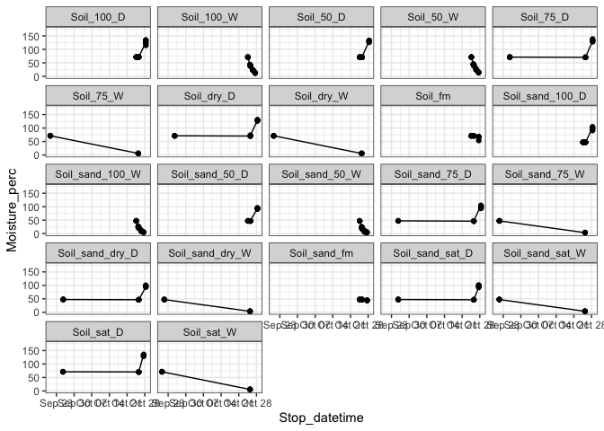

<!-- README.md is generated from README.Rmd. Please edit that file -->

# HYSTERESIS

Tracking moisture in soil cores

Run: 2019-10-27

    #> Warning: Removed 10 rows containing missing values (geom_point).

<!-- -->
