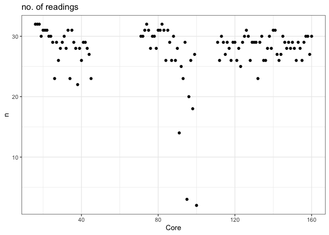
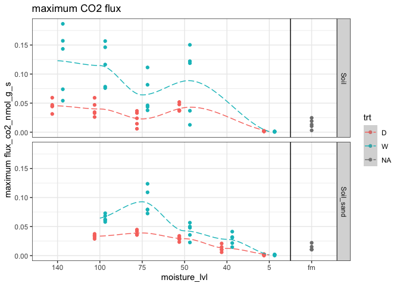
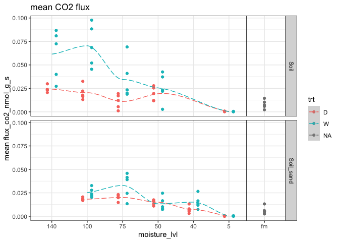
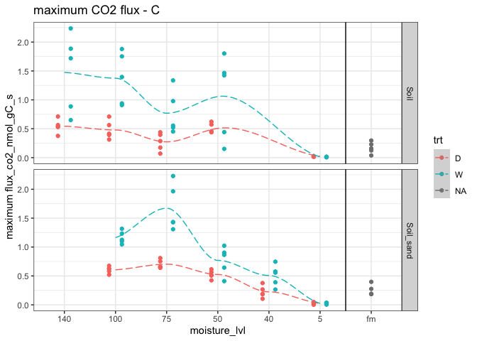

Hysteresis and Soil C
================
Kaizad Patel

Run: 2020-04-20

# 1\. PICARRO DATA

## negative fluxes removed

## initial plots, QA, QC

1.  number of readings

<!-- --> \#\#\# NOTE: most readings removed
for cores 95, 100, and some others

2.  plotting by Core\_assignment

<!-- -->

3.  each core

checking individual flux values for each core

<!-- -->

5.  finding outliers

outlier \> 4 SD from the mean for each group

<!-- -->

6.  checking temporal CV (coefficient of variation) for each core

<!-- -->

-----

7.  comparing mean and
median

<!-- -->

## normalized to soil

<!-- --><!-- --><!-- --><!-- -->

## normalized to TC content

<!-- --><!-- -->

## using percent saturation

<!-- --><!-- -->

## questions

1.  Do we delete flux values below zero?

2.  Fluxes keep oscillating (Fig. 1). Do we know what’s causing that?
    It’s not day-night cycles, since each core was analyzed for only
    ~24 hours.

3.  Soil\_50\_W (cores 111-115 in Fig. 2) had an initial spike. The
    samples were initially air-dry and then wetted, so it could be the
    Birch effect. But this was very short-lived, and this wasn’t seen in
    any of the other "\_W" soils. So maybe trailing CO2 from previous
    samples?
    
    Do we delete the initial pulse?

4.  Soil\_sand\_dry\_W, FIg. 1 (core 95, Fig. 2) had an initial spike
    and then almost no respiration. Pretty sure that’s “wrong” data,
    since the samples were air-dry and no moisture added. Delete that
    high value?

5.  There were unequal number of readings across cores (Fig. 4), as some
    ran a little longer than others, like 24 vs. 25 hours. That would
    influence the cumulative flux calculation. Do we (a) somehow filter
    data to keep it consistent; (b) leave as is; or (c) represent data a
    different way (e.g. max/mean flux)?
