7-nmr\_markdown
================

## SPECTRA

#### spectra

SCL = sandy clay loam (soil)  
SL = sandy loam (soil + sand)

<!-- -->

overlay plots split by treatment

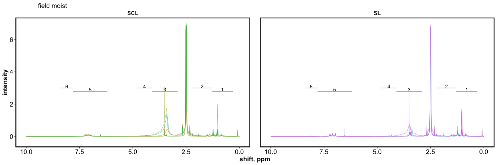<!-- -->

<!-- --><!-- --><!-- --><!-- --><!-- -->

#### representative spectra – 50 % saturation

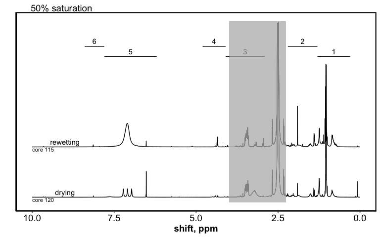<!-- -->

representative spectra – 5 % saturation

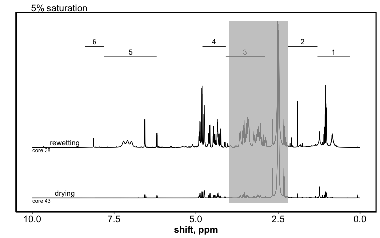<!-- -->

-----

## RELATIVE ABUNDANCE

relative abundance for each sample

<!-- -->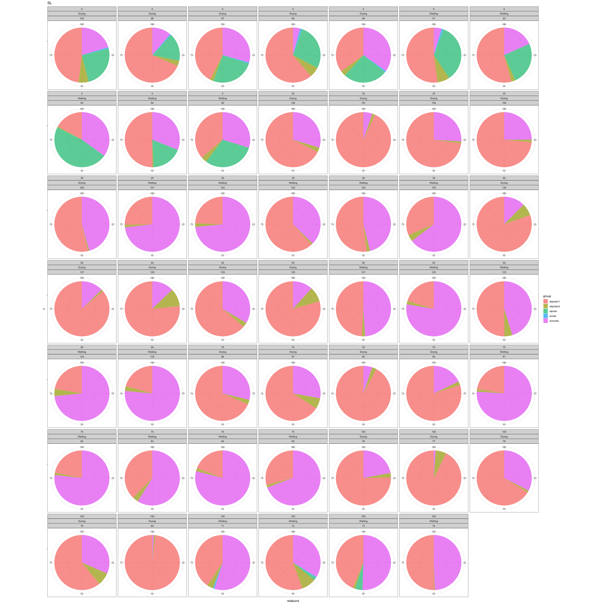<!-- -->

### PCA

    #> Importance of components:
    #>                           PC1    PC2    PC3    PC4       PC5
    #> Standard deviation     1.4709 1.2435 0.8293 0.7762 0.0002099
    #> Proportion of Variance 0.4327 0.3093 0.1376 0.1205 0.0000000
    #> Cumulative Proportion  0.4327 0.7419 0.8795 1.0000 1.0000000
    #> Importance of components:
    #>                           PC1    PC2    PC3     PC4       PC5
    #> Standard deviation     1.4545 1.2844 0.9090 0.63921 0.0001483
    #> Proportion of Variance 0.4231 0.3299 0.1653 0.08172 0.0000000
    #> Cumulative Proportion  0.4231 0.7530 0.9183 1.00000 1.0000000

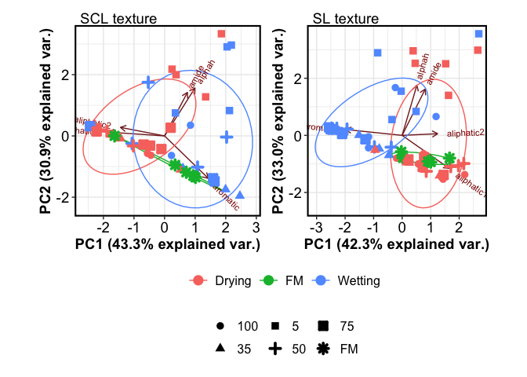<!-- -->

### tables

peaks in field moist soils

|      group |          SCL |           SL |
| ---------: | -----------: | -----------: |
| aliphatic1 | 49.71 ± 6.31 | 67.92 ± 2.97 |
| aliphatic2 |  2.55 ± 1.21 |   5.41 ± 1.1 |
|     alphah |    0.64 ± NA |    1.36 ± NA |
|   aromatic | 47.62 ± 7.38 | 26.39 ± 3.71 |

peaks in treatments

| texture |      group |   100-Drying |  100-Wetting |    35-Drying |   35-Wetting |     5-Drying |    5-Wetting |    50-Drying |    50-Wetting |    75-Drying |   75-Wetting |
| ------: | ---------: | -----------: | -----------: | -----------: | -----------: | -----------: | -----------: | -----------: | ------------: | -----------: | -----------: |
|     SCL | aliphatic1 | 61.67 ± 5.44 | 50.42 ± 3.36 | 66.53 ± 7.69 | 34.36 ± 6.34 | 42.28 ± 4.92 | 32.25 ± 6.61 | 72.66 ± 3.47 | 52.31 ± 10.09 | 57.27 ± 4.09 | 41.03 ± 9.98 |
|     SCL | aliphatic2 | 10.33 ± 1.03 |   1.9 ± 1.37 |  5.04 ± 1.51 |  1.82 ± 1.04 |  3.03 ± 0.81 |  1.74 ± 0.75 | 10.48 ± 1.96 |    4.41 ± 0.9 |  7.79 ± 5.93 |  7.83 ± 7.38 |
|     SCL |     alphah |    0.71 ± NA |  3.43 ± 0.57 |           NA |  1.56 ± 0.15 | 35.42 ± 4.85 | 36.51 ± 4.23 |           NA |      2.11 ± 1 |  3.73 ± 0.48 |  3.06 ± 0.52 |
|     SCL |      amide |           NA |    0.66 ± NA |           NA |           NA |    0.9 ± 0.2 |  0.86 ± 0.05 |           NA |   0.92 ± 0.13 |    0.41 ± NA |           NA |
|     SCL |   aromatic | 27.83 ± 6.58 | 43.91 ± 2.23 | 28.43 ± 8.03 | 62.61 ± 6.27 | 18.82 ± 4.89 | 29.07 ± 3.65 | 16.86 ± 3.38 | 41.81 ± 10.41 | 31.88 ± 2.02 | 49.1 ± 16.34 |
|      SL | aliphatic1 | 78.65 ± 7.29 | 47.52 ± 3.32 | 72.14 ± 6.35 | 38.95 ± 7.52 | 51.08 ± 6.11 | 41.98 ± 6.99 | 77.29 ± 3.73 |  32.55 ± 6.97 | 76.63 ± 6.03 | 26.08 ± 3.36 |
|      SL | aliphatic2 |  3.74 ± 1.38 |  3.44 ± 1.78 |  1.55 ± 0.31 |  2.12 ± 0.49 |  4.06 ± 0.82 |   2.86 ± 1.2 |  6.11 ± 1.81 |   3.11 ± 0.58 |  3.47 ± 0.96 |  1.93 ± 0.37 |
|      SL |     alphah |           NA |   3.1 ± 1.27 |           NA |           NA | 24.11 ± 1.98 | 31.23 ± 4.93 |           NA |            NA |           NA |           NA |
|      SL |      amide |           NA |   0.74 ± 0.2 |           NA |           NA |  0.81 ± 0.07 |    1.06 ± NA |           NA |            NA |           NA |           NA |
|      SL |   aromatic | 17.61 ± 7.05 | 47.12 ± 4.62 | 26.32 ± 6.45 | 58.93 ± 7.33 | 19.95 ± 5.62 | 23.72 ± 5.53 | 16.61 ± 4.22 |  64.33 ± 7.09 |   19.9 ± 5.5 |    72 ± 3.65 |

### rel abund hysteresis?

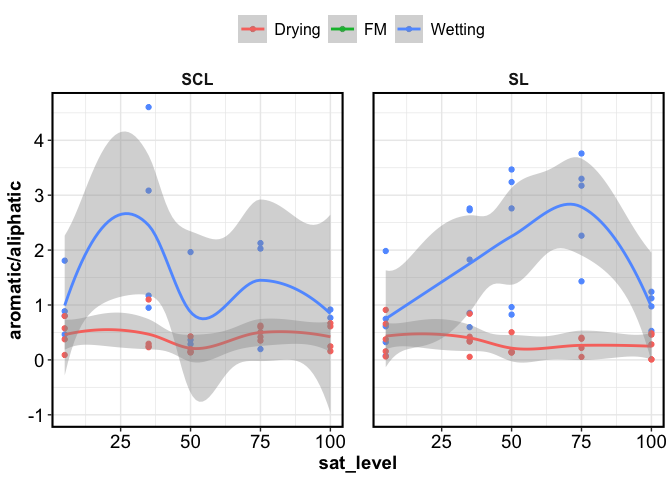<!-- -->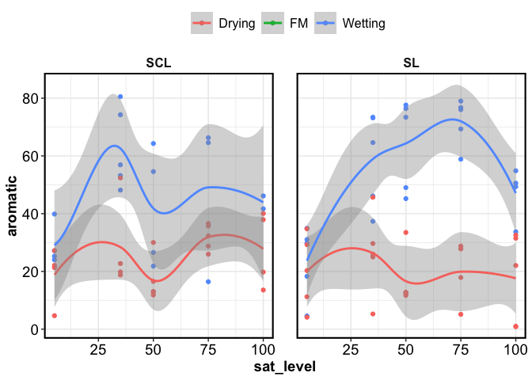<!-- -->

### rel abund waffle plots

all waffle plots

air-dry waffle plots

field moist waffle plots

### more viz

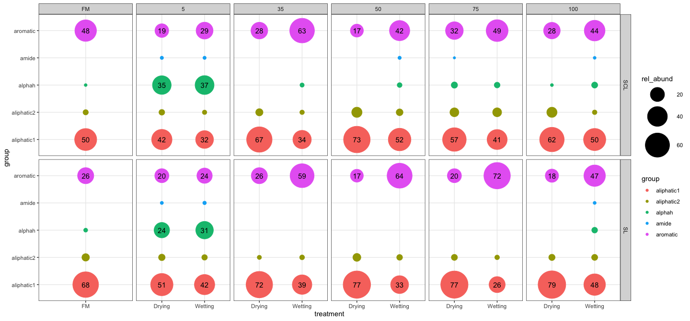<!-- -->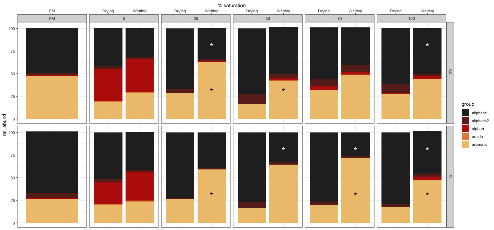<!-- -->

-----

## peak comparisons

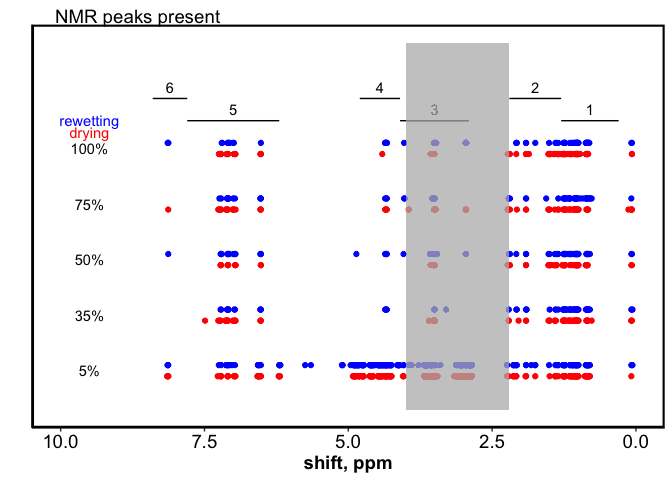<!-- --><!-- -->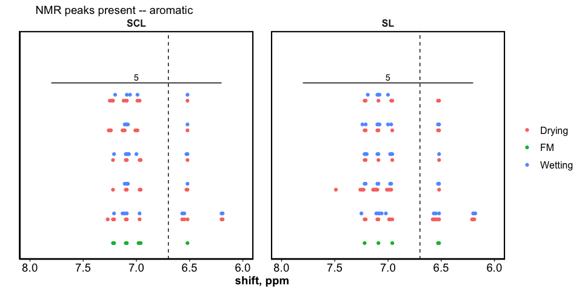<!-- -->

-----

Session Info

date run: 2020-07-22

    #> R version 4.0.2 (2020-06-22)
    #> Platform: x86_64-apple-darwin17.0 (64-bit)
    #> Running under: macOS Catalina 10.15.6
    #> 
    #> Matrix products: default
    #> BLAS:   /Library/Frameworks/R.framework/Versions/4.0/Resources/lib/libRblas.dylib
    #> LAPACK: /Library/Frameworks/R.framework/Versions/4.0/Resources/lib/libRlapack.dylib
    #> 
    #> locale:
    #> [1] en_US.UTF-8/en_US.UTF-8/en_US.UTF-8/C/en_US.UTF-8/en_US.UTF-8
    #> 
    #> attached base packages:
    #> [1] stats     graphics  grDevices utils     datasets  methods   base     
    #> 
    #> other attached packages:
    #>  [1] patchwork_1.0.1    soilpalettes_0.1.0 forcats_0.5.0      stringr_1.4.0     
    #>  [5] dplyr_1.0.0        purrr_0.3.4        readr_1.3.1        tidyr_1.1.0       
    #>  [9] tibble_3.0.3       tidyverse_1.3.0    ggbiplot_0.55      picarro.data_0.1.1
    #> [13] drake_7.12.4       multcomp_1.4-13    TH.data_1.0-10     MASS_7.3-51.6     
    #> [17] survival_3.1-12    mvtnorm_1.1-1      agricolae_1.3-3    car_3.0-8         
    #> [21] carData_3.0-4      nlme_3.1-148       stringi_1.4.6      ggExtra_0.9       
    #> [25] ggalt_0.4.0        ggplot2_3.3.2      reshape2_1.4.4     knitr_1.29        
    #> [29] qwraps2_0.4.2      cowplot_1.0.0      data.table_1.12.8  Rmisc_1.5         
    #> [33] plyr_1.8.6         lattice_0.20-41    luzlogr_0.2.0      lubridate_1.7.9   
    #> [37] readxl_1.3.1      
    #> 
    #> loaded via a namespace (and not attached):
    #>  [1] colorspace_1.4-1   ellipsis_0.3.1     rio_0.5.16         fs_1.4.2          
    #>  [5] rstudioapi_0.11    farver_2.0.3       fansi_0.4.1        xml2_1.3.2        
    #>  [9] codetools_0.2-16   splines_4.0.2      extrafont_0.17     jsonlite_1.7.0    
    #> [13] broom_0.7.0        Rttf2pt1_1.3.8     dbplyr_1.4.4       cluster_2.1.0     
    #> [17] shiny_1.5.0        httr_1.4.2         compiler_4.0.2     backports_1.1.8   
    #> [21] assertthat_0.2.1   Matrix_1.2-18      fastmap_1.0.1      cli_2.0.2         
    #> [25] later_1.1.0.1      htmltools_0.5.0    prettyunits_1.1.1  tools_4.0.2       
    #> [29] igraph_1.2.5       gtable_0.3.0       glue_1.4.1         maps_3.3.0        
    #> [33] Rcpp_1.0.5         cellranger_1.1.0   vctrs_0.3.2        extrafontdb_1.0   
    #> [37] xfun_0.15          rvest_0.3.5        openxlsx_4.1.5     mime_0.9          
    #> [41] miniUI_0.1.1.1     lifecycle_0.2.0    zoo_1.8-8          scales_1.1.1      
    #> [45] hms_0.5.3          promises_1.1.1     parallel_4.0.2     proj4_1.0-10      
    #> [49] sandwich_2.5-1     RColorBrewer_1.1-2 yaml_2.2.1         curl_4.3          
    #> [53] labelled_2.5.0     highr_0.8          klaR_0.6-15        AlgDesign_1.2.0   
    #> [57] filelock_1.0.2     zip_2.0.4          storr_1.2.1        rlang_0.4.7       
    #> [61] pkgconfig_2.0.3    evaluate_0.14      labeling_0.3       tidyselect_1.1.0  
    #> [65] magrittr_1.5       R6_2.4.1           generics_0.0.2     base64url_1.4     
    #> [69] combinat_0.0-8     DBI_1.1.0          txtq_0.2.3         mgcv_1.8-31       
    #> [73] pillar_1.4.6       haven_2.3.1        foreign_0.8-80     withr_2.2.0       
    #> [77] abind_1.4-5        ash_1.0-15         modelr_0.1.8       crayon_1.3.4      
    #> [81] questionr_0.7.1    KernSmooth_2.23-17 rmarkdown_2.3      progress_1.2.2    
    #> [85] grid_4.0.2         blob_1.2.1         reprex_0.3.0       digest_0.6.25     
    #> [89] xtable_1.8-4       httpuv_1.5.4       munsell_0.5.0

