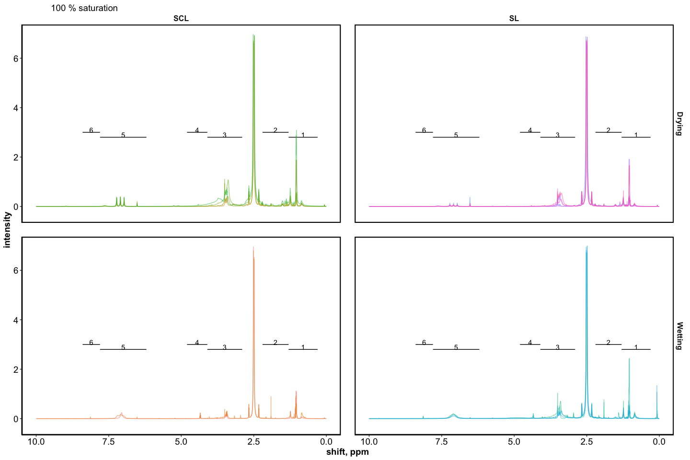
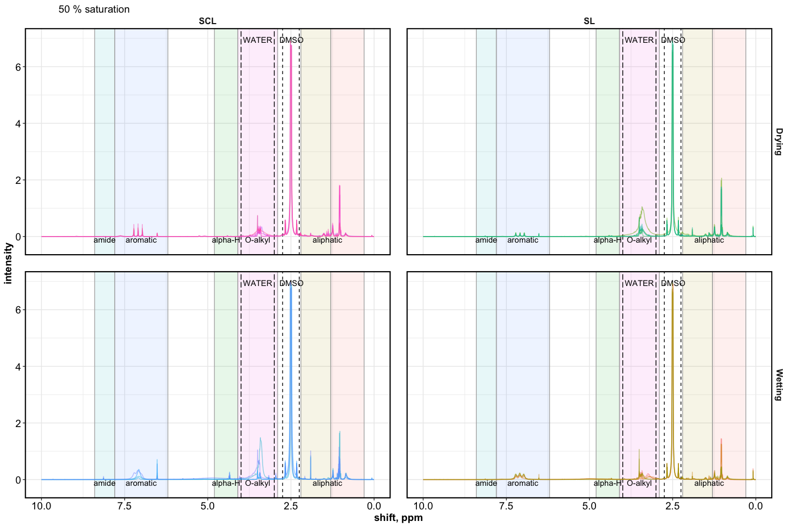
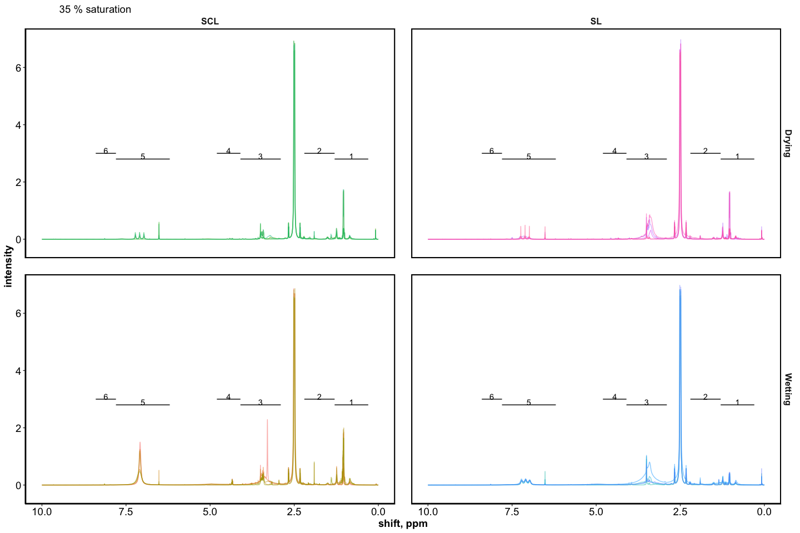
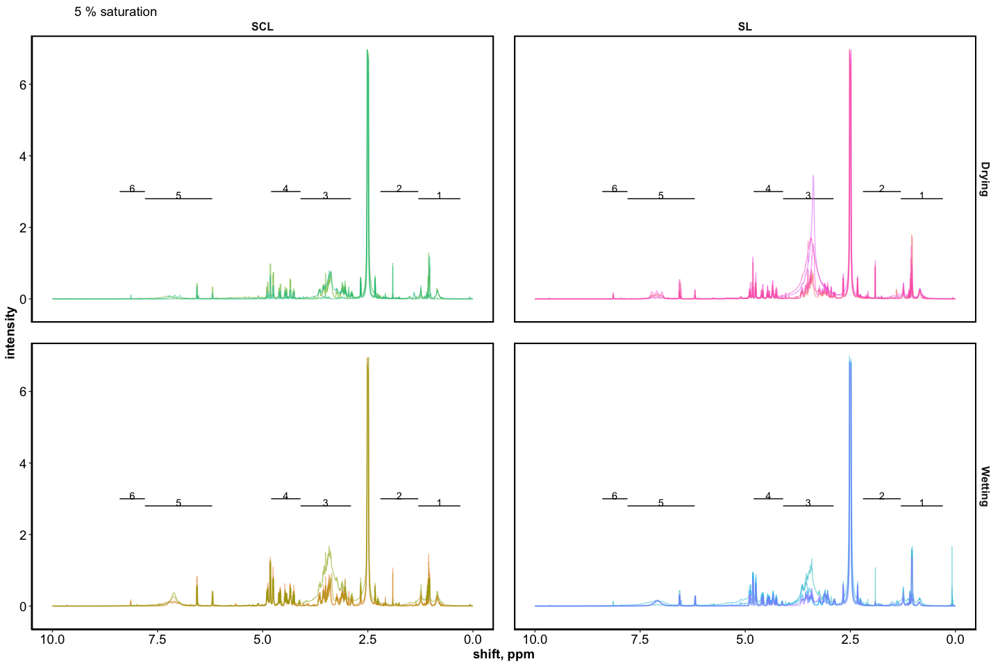
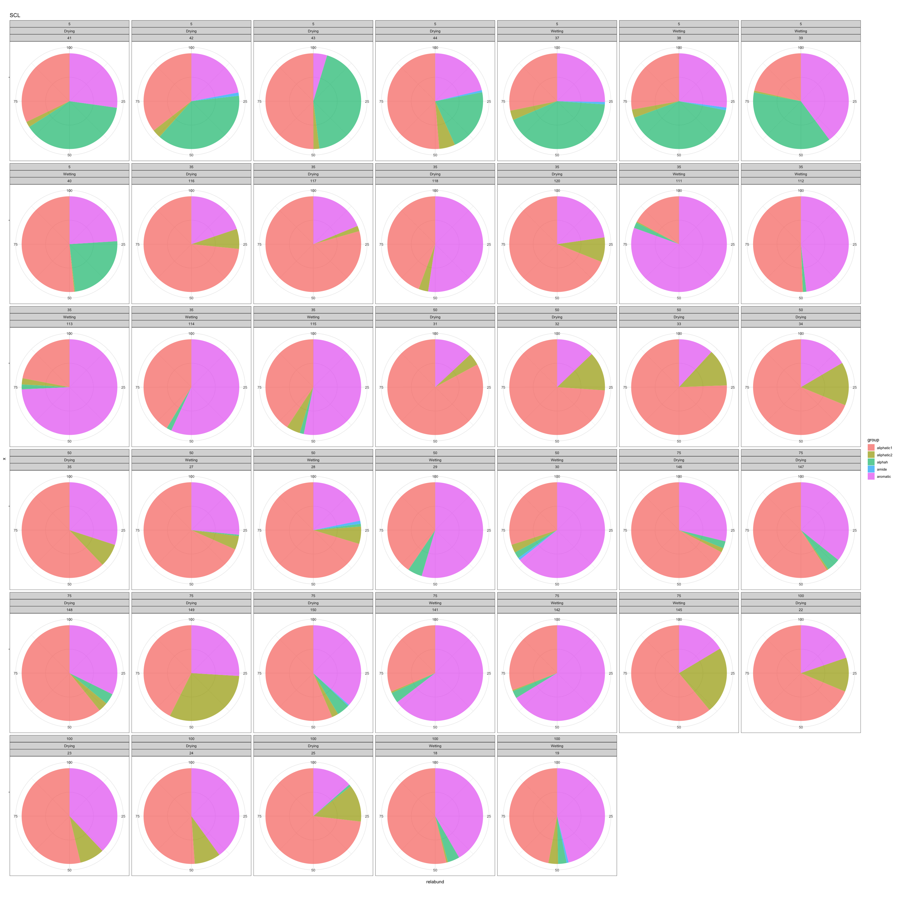
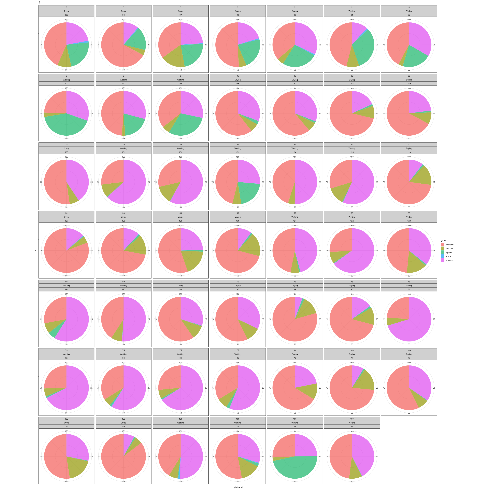
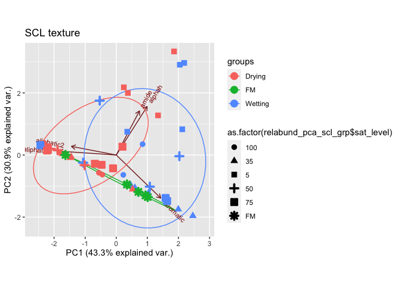
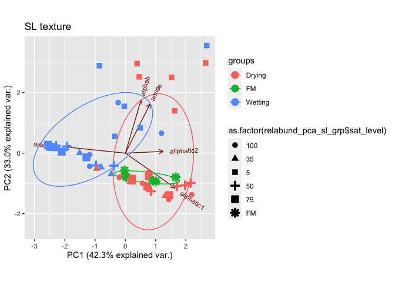

7-nmr\_markdown
================
Kaizad Patel
4/7/2020

## SPECTRA

SCL = sandy clay loam (soil)  
SL = sandy loam (soil +
sand)

<!-- -->

<!-- --><!-- --><!-- --><!-- --><!-- -->

## PEAKS

relative abundance for each sample
<!-- --><!-- -->

## PCA

    #> Importance of components:
    #>                           PC1    PC2    PC3    PC4       PC5
    #> Standard deviation     1.4709 1.2435 0.8293 0.7762 0.0002099
    #> Proportion of Variance 0.4327 0.3093 0.1376 0.1205 0.0000000
    #> Cumulative Proportion  0.4327 0.7419 0.8795 1.0000 1.0000000

<!-- -->

    #> Importance of components:
    #>                           PC1    PC2    PC3     PC4       PC5
    #> Standard deviation     1.4545 1.2844 0.9090 0.63921 0.0001483
    #> Proportion of Variance 0.4231 0.3299 0.1653 0.08172 0.0000000
    #> Cumulative Proportion  0.4231 0.7530 0.9183 1.00000 1.0000000

<!-- -->

## RELATIVE ABUNDANCE

peaks in field moist soils

|      group |          SCL |           SL |
| ---------: | -----------: | -----------: |
| aliphatic1 | 49.71 ± 6.31 | 67.92 ± 2.97 |
| aliphatic2 |  2.55 ± 1.21 |   5.41 ± 1.1 |
|     alphah |    0.64 ± NA |    1.36 ± NA |
|   aromatic | 47.62 ± 7.38 | 26.39 ± 3.71 |

peaks in
treatments

| sat\_level |      group |   SCL-Drying |   SCL-Wetting |    SL-Drying |   SL-Wetting |
| ---------: | ---------: | -----------: | ------------: | -----------: | -----------: |
|          5 | aliphatic1 | 42.28 ± 4.92 |  32.25 ± 6.61 | 51.08 ± 6.11 | 41.98 ± 6.99 |
|          5 | aliphatic2 |  3.03 ± 0.81 |   1.74 ± 0.75 |  4.06 ± 0.82 |   2.86 ± 1.2 |
|          5 |     alphah | 35.42 ± 4.85 |  36.51 ± 4.23 | 24.11 ± 1.98 | 31.23 ± 4.93 |
|          5 |      amide |    0.9 ± 0.2 |   0.86 ± 0.05 |  0.81 ± 0.07 |    1.06 ± NA |
|          5 |   aromatic | 18.82 ± 4.89 |  29.07 ± 3.65 | 19.95 ± 5.62 | 23.72 ± 5.53 |
|         35 | aliphatic1 | 66.53 ± 7.69 |  34.36 ± 6.34 | 72.14 ± 6.35 | 38.95 ± 7.52 |
|         35 | aliphatic2 |  5.04 ± 1.51 |   1.82 ± 1.04 |  1.55 ± 0.31 |  2.12 ± 0.49 |
|         35 |     alphah |           NA |   1.56 ± 0.15 |           NA |           NA |
|         35 |   aromatic | 28.43 ± 8.03 |  62.61 ± 6.27 | 26.32 ± 6.45 | 58.93 ± 7.33 |
|         50 | aliphatic1 | 72.66 ± 3.47 | 52.31 ± 10.09 | 77.29 ± 3.73 | 32.55 ± 6.97 |
|         50 | aliphatic2 | 10.48 ± 1.96 |    4.41 ± 0.9 |  6.11 ± 1.81 |  3.11 ± 0.58 |
|         50 |     alphah |           NA |      2.11 ± 1 |           NA |           NA |
|         50 |      amide |           NA |   0.92 ± 0.13 |           NA |           NA |
|         50 |   aromatic | 16.86 ± 3.38 | 41.81 ± 10.41 | 16.61 ± 4.22 | 64.33 ± 7.09 |
|         75 | aliphatic1 | 57.27 ± 4.09 |  41.03 ± 9.98 | 76.63 ± 6.03 | 26.08 ± 3.36 |
|         75 | aliphatic2 |  7.79 ± 5.93 |   7.83 ± 7.38 |  3.47 ± 0.96 |  1.93 ± 0.37 |
|         75 |     alphah |  3.73 ± 0.48 |   3.06 ± 0.52 |           NA |           NA |
|         75 |      amide |    0.41 ± NA |            NA |           NA |           NA |
|         75 |   aromatic | 31.88 ± 2.02 |  49.1 ± 16.34 |   19.9 ± 5.5 |    72 ± 3.65 |
|        100 | aliphatic1 | 61.67 ± 5.44 |  50.42 ± 3.36 | 78.65 ± 7.29 | 47.52 ± 3.32 |
|        100 | aliphatic2 | 10.33 ± 1.03 |    1.9 ± 1.37 |  3.74 ± 1.38 |  3.44 ± 1.78 |
|        100 |     alphah |    0.71 ± NA |   3.43 ± 0.57 |           NA |   3.1 ± 1.27 |
|        100 |      amide |           NA |     0.66 ± NA |           NA |   0.74 ± 0.2 |
|        100 |   aromatic | 27.83 ± 6.58 |  43.91 ± 2.23 | 17.61 ± 7.05 | 47.12 ± 4.62 |
