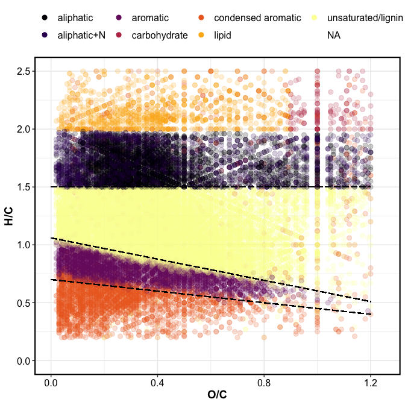
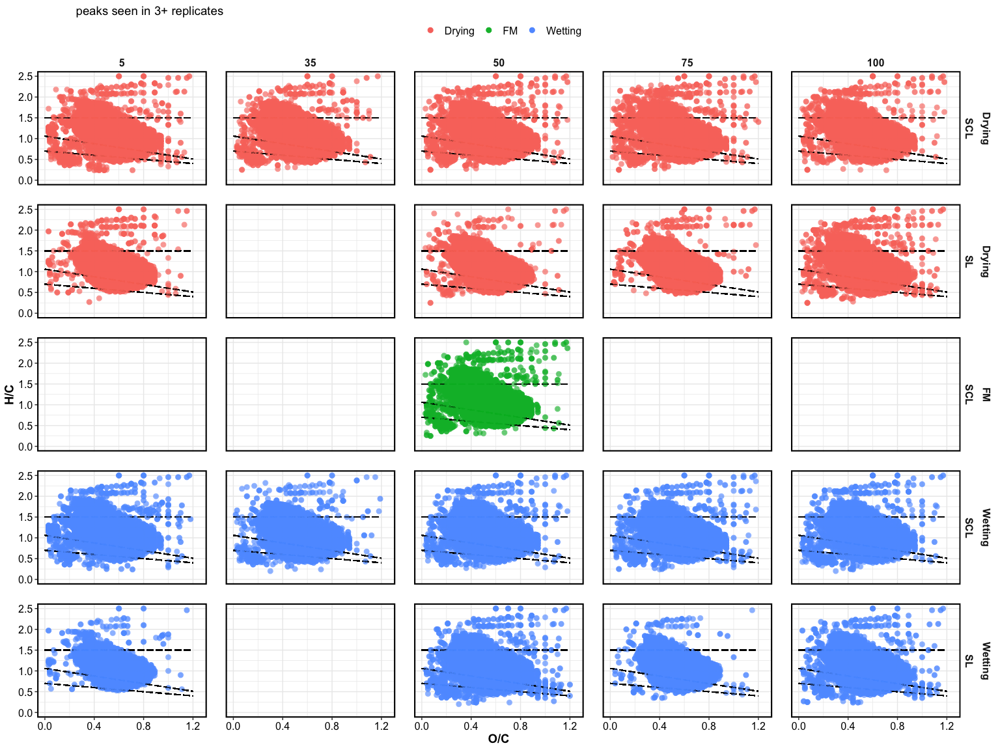

9e-fticr\_markdown
================
Kaizad Patel
4/8/2020

## VAN KREVELEN DOMAINS

<!-- -->

## VAN KREVELEN PLOTS

<!-- -->

## RELATIVE ABUNDANCE

field moist soils

|      Class |   SCL |
| ---------: | ----: |
| AminoSugar |  0.69 |
|       Carb |  0.43 |
|      ConHC | 15.89 |
|     Lignin | 55.11 |
|      Lipid |  2.86 |
|      Other |  0.26 |
|    Protein | 13.51 |
|     Tannin | 11.17 |
|    UnsatHC |  0.09 |

treatment

| sat\_level |      Class | SCL-Drying | SCL-Wetting |
| ---------: | ---------: | ---------: | ----------: |
|          5 | AminoSugar |         NA |        0.98 |
|          5 |       Carb |         NA |        1.02 |
|          5 |      ConHC |         NA |       14.82 |
|          5 |     Lignin |         NA |       50.96 |
|          5 |      Lipid |         NA |        3.14 |
|          5 |      Other |         NA |        0.47 |
|          5 |    Protein |         NA |       11.97 |
|          5 |     Tannin |         NA |       14.35 |
|          5 |    UnsatHC |         NA |        2.29 |
|         35 | AminoSugar |       0.54 |        0.77 |
|         35 |       Carb |       0.09 |        0.09 |
|         35 |      ConHC |      17.84 |       19.13 |
|         35 |     Lignin |      55.43 |       55.58 |
|         35 |      Lipid |       3.35 |        2.10 |
|         35 |      Other |       0.14 |        0.05 |
|         35 |    Protein |      11.10 |        8.52 |
|         35 |     Tannin |      11.46 |       13.71 |
|         35 |    UnsatHC |       0.05 |        0.05 |
|         50 | AminoSugar |       1.01 |        1.02 |
|         50 |       Carb |       0.66 |        0.34 |
|         50 |      ConHC |      15.34 |       16.54 |
|         50 |     Lignin |      52.99 |       53.03 |
|         50 |      Lipid |       2.47 |        1.93 |
|         50 |      Other |       0.66 |        0.38 |
|         50 |    Protein |      13.36 |       11.20 |
|         50 |     Tannin |      13.43 |       15.48 |
|         50 |    UnsatHC |       0.07 |        0.08 |
|        100 | AminoSugar |       0.29 |        0.83 |
|        100 |       Carb |         NA |        0.11 |
|        100 |      ConHC |       4.27 |       17.05 |
|        100 |     Lignin |      62.33 |       52.90 |
|        100 |      Lipid |       5.96 |        1.51 |
|        100 |      Other |       1.10 |        0.25 |
|        100 |    Protein |      25.90 |       10.56 |
|        100 |     Tannin |       0.15 |       16.72 |
|        100 |    UnsatHC |         NA |        0.07 |
