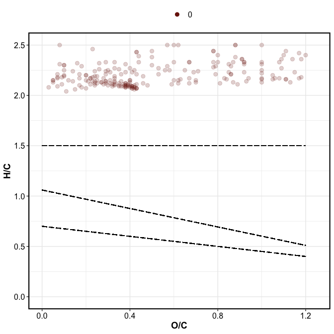
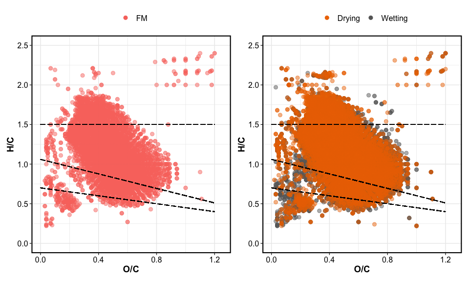
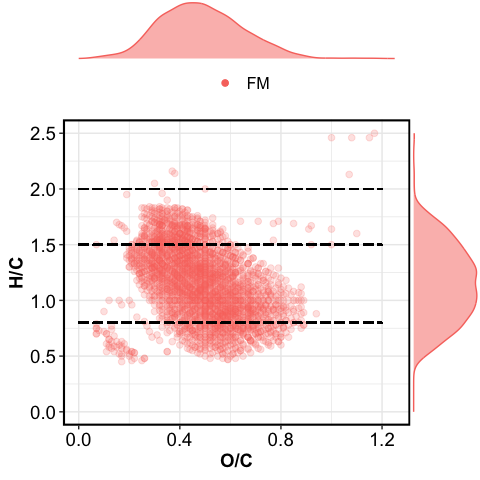
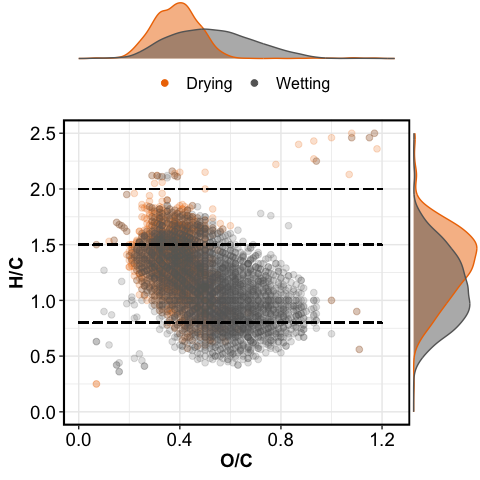
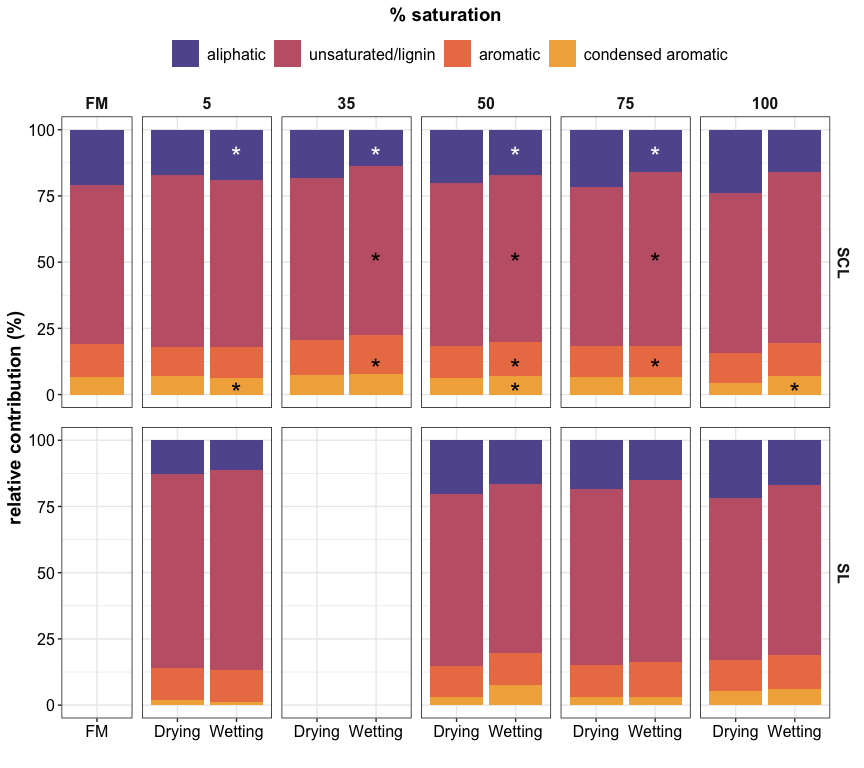

9e-fticr\_markdown
================
Kaizad Patel
4/8/2020

## VAN KREVELEN DOMAINS

<!-- --><!-- -->

## VAN KREVELEN PLOTS

<!-- -->

    #> Aesthetic mapping: 
    #> * `group` -> `rev(treatment)`

<!-- -->

<!-- -->

<!-- -->

## RELATIVE ABUNDANCE

field moist soils

treatment

### bar plots

<!-- -->
