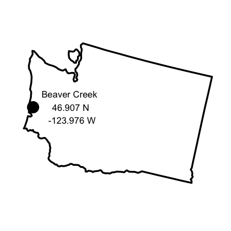

Soil carbon dynamics during drying vs. rewetting: importance of
antecedent moisture conditions
================

How are soil carbon dynamics influenced by drying vs. wetting events?

<!-- -->

|                     | Soil 1   | Soil 2        |
| ------------------- | -------- | ------------- |
|                     | BC soil  | BC + Accusand |
| Texture             | SCL      | SL            |
| Total C (%)         | 8.34 %   | 5.56%         |
| Saturation moisture | 140% w/w | 100% w/w      |

``` 
moisture (5 levels): 100% saturated, 75% w/w, 50%, 35%, 5% (air dry)
    + field moist  
treatment (2 levels): wetting, drying  
texture (2 levels): sandy clay loam (SCL), sandy loam (SL)  
```

-----

## code

`1-moisture_tracking.R`: tracks moisture in cores for pre-incubation
drying  
`2-hyprop`: water retention curves  
`3-picarro`: respiration  
`4-wsoc`: water soluble organic carbon analysis

## data

`core_key` core assignments

`core_weights`

  - `initial` initial weights when cores were packed. includes empty
    weights
  - `Mass_tracking` core weights for pre-incubation drying. Also
    includes Picarro valve assignments.
  - ignore tabs marked `x_`

-----

<details>

<summary>Session Info</summary>

date: 2020-07-21

    #> R version 4.0.2 (2020-06-22)
    #> Platform: x86_64-apple-darwin17.0 (64-bit)
    #> Running under: macOS Catalina 10.15.6
    #> 
    #> Matrix products: default
    #> BLAS:   /Library/Frameworks/R.framework/Versions/4.0/Resources/lib/libRblas.dylib
    #> LAPACK: /Library/Frameworks/R.framework/Versions/4.0/Resources/lib/libRlapack.dylib
    #> 
    #> locale:
    #> [1] en_US.UTF-8/en_US.UTF-8/en_US.UTF-8/C/en_US.UTF-8/en_US.UTF-8
    #> 
    #> attached base packages:
    #> [1] stats     graphics  grDevices utils     datasets  methods   base     
    #> 
    #> other attached packages:
    #> [1] usmap_0.5.0   ggplot2_3.3.2
    #> 
    #> loaded via a namespace (and not attached):
    #>  [1] pillar_1.4.6     compiler_4.0.2   tools_4.0.2      digest_0.6.25   
    #>  [5] evaluate_0.14    lifecycle_0.2.0  tibble_3.0.3     gtable_0.3.0    
    #>  [9] lattice_0.20-41  pkgconfig_2.0.3  rlang_0.4.7      yaml_2.2.1      
    #> [13] rgdal_1.5-12     xfun_0.15        withr_2.2.0      dplyr_1.0.0     
    #> [17] stringr_1.4.0    knitr_1.29       generics_0.0.2   vctrs_0.3.2     
    #> [21] grid_4.0.2       tidyselect_1.1.0 glue_1.4.1       R6_2.4.1        
    #> [25] foreign_0.8-80   rmarkdown_2.3    sp_1.4-2         purrr_0.3.4     
    #> [29] farver_2.0.3     magrittr_1.5     scales_1.1.1     ellipsis_0.3.1  
    #> [33] htmltools_0.5.0  maptools_1.0-1   colorspace_1.4-1 labeling_0.3    
    #> [37] stringi_1.4.6    munsell_0.5.0    crayon_1.3.4

</details>
