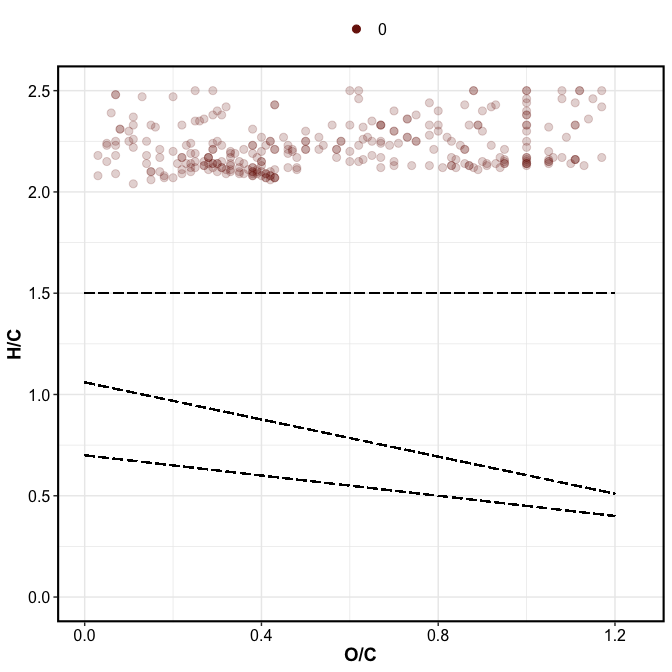
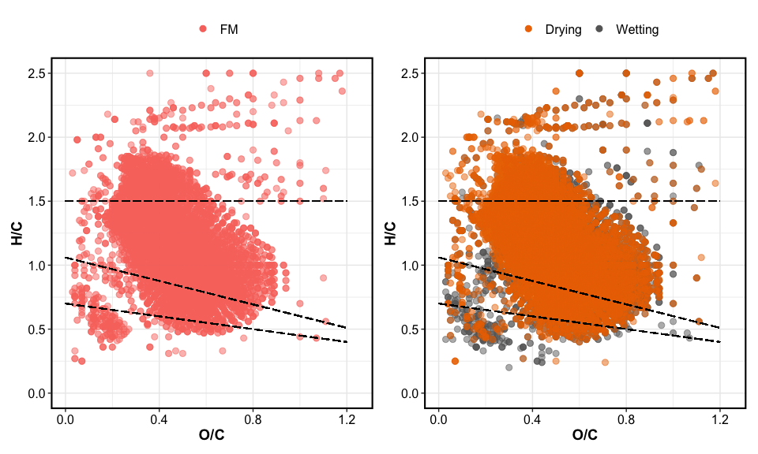
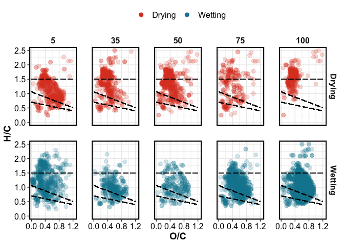
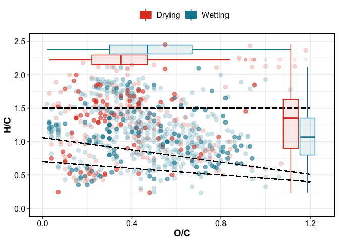

9e-fticr\_markdown
================
Kaizad Patel
4/8/2020

## VAN KREVELEN DOMAINS

<!-- --><!-- -->

## VAN KREVELEN PLOTS

<!-- -->

    #> Aesthetic mapping: 
    #> * `group` -> `rev(treatment)`

<!-- -->

<!-- -->

<!-- -->

## RELATIVE ABUNDANCE

field moist soils

treatment

### bar plots

<!-- -->

### van krevelen unique

<!-- --><!-- -->

| texture | Class              | Drying | FM | Wetting |
| :------ | :----------------- | -----: | -: | ------: |
| SCL     | aliphatic          |    119 |  7 |     121 |
| SCL     | aromatic           |     18 |  3 |      79 |
| SCL     | condensed aromatic |     51 | 11 |      76 |
| SCL     | unsaturated/lignin |    133 |  4 |     358 |
