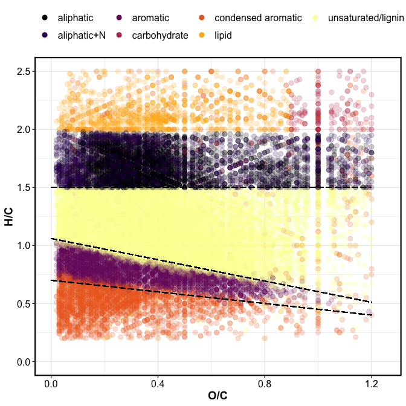
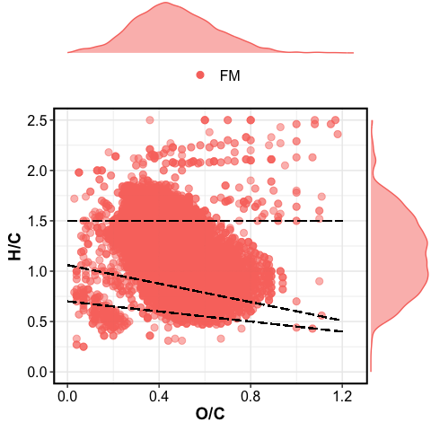

fticr\_markdown
================

## VAN KREVELEN DOMAINS

<!-- --><!-- -->

## VAN KREVELEN PLOTS

<!-- -->

    #> Aesthetic mapping: 
    #> * `group` -> `rev(treatment)`

<!-- -->

<!-- -->

<!-- -->

## RELATIVE ABUNDANCE

field moist soils

treatment

### bar plots

<!-- -->

### van krevelen unique

<!-- --><!-- -->

| texture | Class              | Drying | FM | Wetting |
| :------ | :----------------- | -----: | -: | ------: |
| SCL     | aliphatic          |    119 |  7 |     121 |
| SCL     | aromatic           |     18 |  3 |      79 |
| SCL     | condensed aromatic |     51 | 11 |      76 |
| SCL     | unsaturated/lignin |    133 |  4 |     358 |

-----

Session Info

**Kaizad F. Patel**

Date run: 2021-01-11

    #> R version 4.0.2 (2020-06-22)
    #> Platform: x86_64-apple-darwin17.0 (64-bit)
    #> Running under: macOS Catalina 10.15.7
    #> 
    #> Matrix products: default
    #> BLAS:   /Library/Frameworks/R.framework/Versions/4.0/Resources/lib/libRblas.dylib
    #> LAPACK: /Library/Frameworks/R.framework/Versions/4.0/Resources/lib/libRlapack.dylib
    #> 
    #> locale:
    #> [1] en_US.UTF-8/en_US.UTF-8/en_US.UTF-8/C/en_US.UTF-8/en_US.UTF-8
    #> 
    #> attached base packages:
    #> [1] stats     graphics  grDevices utils     datasets  methods   base     
    #> 
    #> other attached packages:
    #>  [1] scales_1.1.1       patchwork_1.0.1    soilpalettes_0.1.0 forcats_0.5.0     
    #>  [5] stringr_1.4.0      dplyr_1.0.1        purrr_0.3.4        readr_1.3.1       
    #>  [9] tidyr_1.1.1        tibble_3.0.3       tidyverse_1.3.0    ggbiplot_0.55     
    #> [13] picarro.data_0.1.1 drake_7.12.4       multcomp_1.4-13    TH.data_1.0-10    
    #> [17] MASS_7.3-51.6      survival_3.2-3     mvtnorm_1.1-1      agricolae_1.3-3   
    #> [21] car_3.0-9          carData_3.0-4      nlme_3.1-148       stringi_1.4.6     
    #> [25] ggExtra_0.9        ggalt_0.6.2        ggplot2_3.3.2      reshape2_1.4.4    
    #> [29] knitr_1.29         qwraps2_0.4.2      cowplot_1.0.0      data.table_1.13.0 
    #> [33] Rmisc_1.5          plyr_1.8.6         lattice_0.20-41    luzlogr_0.2.0     
    #> [37] lubridate_1.7.9    readxl_1.3.1      
    #> 
    #> loaded via a namespace (and not attached):
    #>  [1] colorspace_1.4-1   ellipsis_0.3.1     rio_0.5.16         fs_1.5.0          
    #>  [5] rstudioapi_0.11    farver_2.0.3       fansi_0.4.1        xml2_1.3.2        
    #>  [9] codetools_0.2-16   splines_4.0.2      extrafont_0.17     jsonlite_1.7.0    
    #> [13] broom_0.7.0        Rttf2pt1_1.3.8     dbplyr_1.4.4       cluster_2.1.0     
    #> [17] shiny_1.5.0        httr_1.4.2         compiler_4.0.2     backports_1.1.8   
    #> [21] assertthat_0.2.1   Matrix_1.2-18      fastmap_1.0.1      cli_2.0.2         
    #> [25] later_1.1.0.1      htmltools_0.5.0    prettyunits_1.1.1  tools_4.0.2       
    #> [29] igraph_1.2.5       gtable_0.3.0       glue_1.4.1         maps_3.3.0        
    #> [33] Rcpp_1.0.5         cellranger_1.1.0   vctrs_0.3.2        extrafontdb_1.0   
    #> [37] xfun_0.16          rvest_0.3.6        openxlsx_4.1.5     mime_0.9          
    #> [41] miniUI_0.1.1.1     lifecycle_0.2.0    zoo_1.8-8          hms_0.5.3         
    #> [45] promises_1.1.1     parallel_4.0.2     proj4_1.0-10       sandwich_2.5-1    
    #> [49] RColorBrewer_1.1-2 yaml_2.2.1         curl_4.3           labelled_2.5.0    
    #> [53] highr_0.8          klaR_0.6-15        AlgDesign_1.2.0    PNWColors_0.1.0   
    #> [57] filelock_1.0.2     zip_2.1.0          storr_1.2.1        rlang_0.4.7       
    #> [61] pkgconfig_2.0.3    evaluate_0.14      labeling_0.3       tidyselect_1.1.0  
    #> [65] magrittr_1.5       R6_2.4.1           generics_0.0.2     base64url_1.4     
    #> [69] combinat_0.0-8     DBI_1.1.0          txtq_0.2.3         pillar_1.4.6      
    #> [73] haven_2.3.1        foreign_0.8-80     withr_2.2.0        abind_1.4-5       
    #> [77] ash_1.0-15         modelr_0.1.8       crayon_1.3.4       questionr_0.7.1   
    #> [81] KernSmooth_2.23-17 rmarkdown_2.3      progress_1.2.2     grid_4.0.2        
    #> [85] blob_1.2.1         reprex_0.3.0       digest_0.6.25      xtable_1.8-4      
    #> [89] httpuv_1.5.4       munsell_0.5.0      viridisLite_0.3.0

-----
