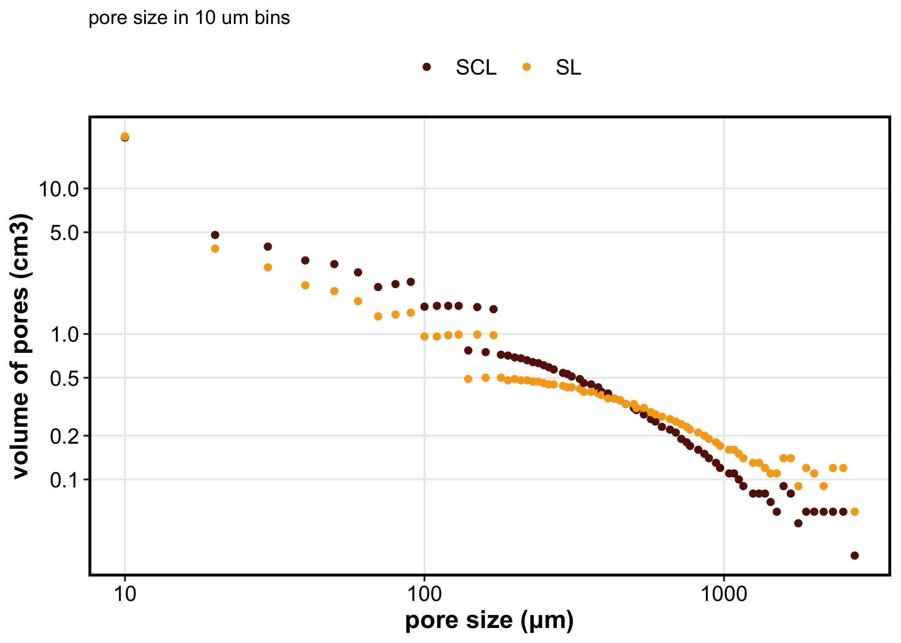
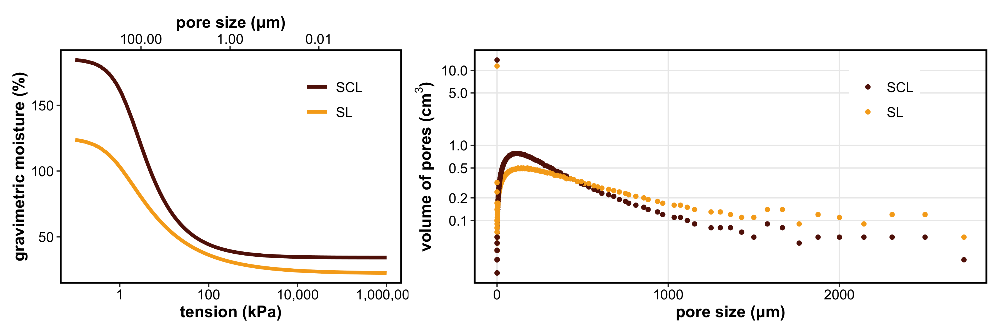
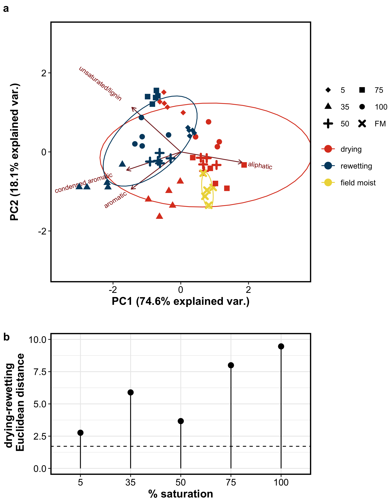

# Soil carbon dynamics during drying vs. rewetting: importance of antecedent moisture conditions

## results

-----

## WATER RETENTION CURVES

<!-- --><!-- -->

<!-- --><!-- -->

<!-- -->

<!-- -->

-----

## RESPIRATION

    #>                              Df Sum Sq Mean Sq F value   Pr(>F)    
    #> treatment                     2 1.2411  0.6205  29.828 6.93e-11 ***
    #> texture                       1 0.0333  0.0333   1.599   0.2090    
    #> sat_level                     1 2.8265  2.8265 135.863  < 2e-16 ***
    #> treatment:texture             2 0.1739  0.0870   4.180   0.0181 *  
    #> treatment:sat_level           1 0.4240  0.4240  20.382 1.74e-05 ***
    #> texture:sat_level             1 0.0154  0.0154   0.742   0.3911    
    #> treatment:texture:sat_level   1 0.0909  0.0909   4.368   0.0392 *  
    #> Residuals                   100 2.0804  0.0208                     
    #> ---
    #> Signif. codes:  0 '***' 0.001 '**' 0.01 '*' 0.05 '.' 0.1 ' ' 1

<!-- -->

<!-- -->

-----

## WSOC

<!-- -->

    #>                             Df  Sum Sq Mean Sq F value   Pr(>F)    
    #> treatment                    2 0.11593 0.05796 115.894  < 2e-16 ***
    #> texture                      1 0.00109 0.00109   2.176 0.144063    
    #> sat_level                    1 0.00458 0.00458   9.163 0.003323 ** 
    #> treatment:texture            2 0.00339 0.00170   3.390 0.038635 *  
    #> treatment:sat_level          1 0.01380 0.01380  27.594 1.21e-06 ***
    #> texture:sat_level            1 0.00328 0.00328   6.566 0.012272 *  
    #> treatment:texture:sat_level  1 0.00665 0.00665  13.302 0.000471 ***
    #> Residuals                   80 0.04001 0.00050                     
    #> ---
    #> Signif. codes:  0 '***' 0.001 '**' 0.01 '*' 0.05 '.' 0.1 ' ' 1

For field moist conditions, WSOC was significantly greater in SL than in
SCL soils.

``` r
aov_wsoc_fm = aov(wsoc_mg_g ~ texture, data = wsoc %>% filter(treatment=="FM"))
summary(aov_wsoc_fm)
#>             Df    Sum Sq   Mean Sq F value Pr(>F)  
#> texture      1 0.0005776 0.0005776   6.654 0.0326 *
#> Residuals    8 0.0006944 0.0000868                 
#> ---
#> Signif. codes:  0 '***' 0.001 '**' 0.01 '*' 0.05 '.' 0.1 ' ' 1
h = agricolae::HSD.test(aov_wsoc_fm, trt = "texture");h
#> $statistics
#>    MSerror Df  Mean       CV        MSD
#>   8.68e-05  8 0.082 11.36177 0.01358782
#> 
#> $parameters
#>    test  name.t ntr StudentizedRange alpha
#>   Tukey texture   2         3.261182  0.05
#> 
#> $means
#>     wsoc_mg_g         std r   Min   Max   Q25   Q50   Q75
#> SCL    0.0744 0.007162402 5 0.062 0.080 0.075 0.077 0.078
#> SL     0.0896 0.011058933 5 0.078 0.104 0.080 0.089 0.097
#> 
#> $comparison
#> NULL
#> 
#> $groups
#>     wsoc_mg_g groups
#> SL     0.0896      a
#> SCL    0.0744      b
#> 
#> attr(,"class")
#> [1] "group"
```

-----

## FTICR

<!-- -->

### PERMANOVA

    #> Permutation test for adonis under reduced model
    #> Terms added sequentially (first to last)
    #> Permutation: free
    #> Number of permutations: 999
    #> 
    #> adonis2(formula = relabund2$DV ~ treatment * sat_level, data = relabund2)
    #>                     Df SumOfSqs      R2       F Pr(>F)    
    #> treatment            1 0.018955 0.22247 17.2485  0.001 ***
    #> sat_level            1 0.004090 0.04800  3.7217  0.036 *  
    #> treatment:sat_level  1 0.011607 0.13623 10.5627  0.001 ***
    #> Residual            46 0.050550 0.59330                   
    #> Total               49 0.085202 1.00000                   
    #> ---
    #> Signif. codes:  0 '***' 0.001 '**' 0.01 '*' 0.05 '.' 0.1 ' ' 1

### relative abundance bar plots

<!-- -->

### relative abundance PCA

<!-- -->

-----

## NMR

### spectra

    #> ACTION: choose correct value of BINSET
    #>       a.> Clemente2012
    #>       b.> Lynch2019
    #>   type this into the code
    #>   e.g.: BINSET = [quot]Clemente2012[quot]

#### representative spectra – 50 % saturation

<!-- -->

representative spectra – 5 % saturation

### PCA

<!-- -->

<!-- -->

### RELATIVE ABUNDANCE

### stats

PERMANOVA: treatment and moisture level had a significant influence

    #> Permutation test for adonis under reduced model
    #> Terms added sequentially (first to last)
    #> Permutation: free
    #> Number of permutations: 999
    #> 
    #> adonis2(formula = rel_abund2$DV ~ treatment * sat_level + sat_level * texture + treatment * texture, data = rel_abund2)
    #>                     Df SumOfSqs      R2       F Pr(>F)    
    #> treatment            2   1.9419 0.31916 27.9847  0.001 ***
    #> sat_level            1   0.7115 0.11694 20.5067  0.001 ***
    #> texture              1   0.0620 0.01019  1.7869  0.159    
    #> treatment:sat_level  1   0.0724 0.01190  2.0875  0.116    
    #> sat_level:texture    1   0.0542 0.00891  1.5630  0.217    
    #> treatment:texture    2   0.1545 0.02539  2.2262  0.076 .  
    #> Residual            89   3.0880 0.50751                   
    #> Total               97   6.0846 1.00000                   
    #> ---
    #> Signif. codes:  0 '***' 0.001 '**' 0.01 '*' 0.05 '.' 0.1 ' ' 1
    #> Permutation test for adonis under reduced model
    #> Terms added sequentially (first to last)
    #> Permutation: free
    #> Number of permutations: 999
    #> 
    #> adonis2(formula = rel_abund2$DV ~ treatment * sat_level, data = rel_abund2)
    #>                     Df SumOfSqs      R2       F Pr(>F)    
    #> treatment            2   1.9419 0.31916 26.8456  0.001 ***
    #> sat_level            1   0.7115 0.11694 19.6720  0.001 ***
    #> treatment:sat_level  1   0.0674 0.01108  1.8647  0.138    
    #> Residual            93   3.3637 0.55282                   
    #> Total               97   6.0846 1.00000                   
    #> ---
    #> Signif. codes:  0 '***' 0.001 '**' 0.01 '*' 0.05 '.' 0.1 ' ' 1

### tables

peaks in field moist soils

|      group |          SCL |           SL |
| ---------: | -----------: | -----------: |
| aliphatic1 | 49.71 ± 6.31 | 67.92 ± 2.97 |
| aliphatic2 |  2.55 ± 1.21 |   5.41 ± 1.1 |
|     alphah |    0.64 ± NA |    1.36 ± NA |
|   aromatic | 47.62 ± 7.38 | 26.39 ± 3.71 |

peaks in treatments

| texture |      group |   100-Drying |  100-Wetting |    35-Drying |   35-Wetting |     5-Drying |    5-Wetting |    50-Drying |    50-Wetting |    75-Drying |   75-Wetting |
| ------: | ---------: | -----------: | -----------: | -----------: | -----------: | -----------: | -----------: | -----------: | ------------: | -----------: | -----------: |
|     SCL | aliphatic1 | 61.67 ± 5.44 | 50.42 ± 3.36 | 66.53 ± 7.69 | 34.36 ± 6.34 | 42.28 ± 4.92 | 32.25 ± 6.61 | 72.66 ± 3.47 | 52.31 ± 10.09 | 57.27 ± 4.09 | 41.03 ± 9.98 |
|     SCL | aliphatic2 | 10.33 ± 1.03 |   1.9 ± 1.37 |  5.04 ± 1.51 |  1.82 ± 1.04 |  3.03 ± 0.81 |  1.74 ± 0.75 | 10.48 ± 1.96 |    4.41 ± 0.9 |  7.79 ± 5.93 |  7.83 ± 7.38 |
|     SCL |     alphah |    0.71 ± NA |  3.43 ± 0.57 |           NA |  1.56 ± 0.15 | 35.42 ± 4.85 | 36.51 ± 4.23 |           NA |      2.11 ± 1 |  3.73 ± 0.48 |  3.06 ± 0.52 |
|     SCL |      amide |           NA |    0.66 ± NA |           NA |           NA |    0.9 ± 0.2 |  0.86 ± 0.05 |           NA |   0.92 ± 0.13 |    0.41 ± NA |           NA |
|     SCL |   aromatic | 27.83 ± 6.58 | 43.91 ± 2.23 | 28.43 ± 8.03 | 62.61 ± 6.27 | 18.82 ± 4.89 | 29.07 ± 3.65 | 16.86 ± 3.38 | 41.81 ± 10.41 | 31.88 ± 2.02 | 49.1 ± 16.34 |
|      SL | aliphatic1 | 78.65 ± 7.29 | 47.52 ± 3.32 | 72.14 ± 6.35 | 38.95 ± 7.52 | 51.08 ± 6.11 | 41.98 ± 6.99 | 77.29 ± 3.73 |  32.55 ± 6.97 | 76.63 ± 6.03 | 26.08 ± 3.36 |
|      SL | aliphatic2 |  3.74 ± 1.38 |  3.44 ± 1.78 |  1.55 ± 0.31 |  2.12 ± 0.49 |  4.06 ± 0.82 |   2.86 ± 1.2 |  6.11 ± 1.81 |   3.11 ± 0.58 |  3.47 ± 0.96 |  1.93 ± 0.37 |
|      SL |     alphah |           NA |   3.1 ± 1.27 |           NA |           NA | 24.11 ± 1.98 | 31.23 ± 4.93 |           NA |            NA |           NA |           NA |
|      SL |      amide |           NA |   0.74 ± 0.2 |           NA |           NA |  0.81 ± 0.07 |    1.06 ± NA |           NA |            NA |           NA |           NA |
|      SL |   aromatic | 17.61 ± 7.05 | 47.12 ± 4.62 | 26.32 ± 6.45 | 58.93 ± 7.33 | 19.95 ± 5.62 | 23.72 ± 5.53 | 16.61 ± 4.22 |  64.33 ± 7.09 |   19.9 ± 5.5 |    72 ± 3.65 |

### bar graph

<!-- -->

-----

### Session Info

Run: 2021-01-11

    #> R version 4.0.2 (2020-06-22)
    #> Platform: x86_64-apple-darwin17.0 (64-bit)
    #> Running under: macOS Catalina 10.15.7
    #> 
    #> Matrix products: default
    #> BLAS:   /Library/Frameworks/R.framework/Versions/4.0/Resources/lib/libRblas.dylib
    #> LAPACK: /Library/Frameworks/R.framework/Versions/4.0/Resources/lib/libRlapack.dylib
    #> 
    #> locale:
    #> [1] en_US.UTF-8/en_US.UTF-8/en_US.UTF-8/C/en_US.UTF-8/en_US.UTF-8
    #> 
    #> attached base packages:
    #> [1] stats     graphics  grDevices utils     datasets  methods   base     
    #> 
    #> other attached packages:
    #>  [1] ggpubr_0.4.0       ape_5.4-1          scales_1.1.1       patchwork_1.0.1   
    #>  [5] vegan_2.5-6        permute_0.9-5      soilpalettes_0.1.0 forcats_0.5.0     
    #>  [9] stringr_1.4.0      dplyr_1.0.1        purrr_0.3.4        readr_1.3.1       
    #> [13] tidyr_1.1.1        tibble_3.0.3       tidyverse_1.3.0    ggbiplot_0.55     
    #> [17] picarro.data_0.1.1 drake_7.12.4       multcomp_1.4-13    TH.data_1.0-10    
    #> [21] MASS_7.3-51.6      survival_3.2-3     mvtnorm_1.1-1      agricolae_1.3-3   
    #> [25] car_3.0-9          carData_3.0-4      nlme_3.1-148       stringi_1.4.6     
    #> [29] ggExtra_0.9        ggalt_0.6.2        ggplot2_3.3.2      reshape2_1.4.4    
    #> [33] knitr_1.29         qwraps2_0.4.2      cowplot_1.0.0      data.table_1.13.0 
    #> [37] Rmisc_1.5          plyr_1.8.6         lattice_0.20-41    luzlogr_0.2.0     
    #> [41] lubridate_1.7.9    readxl_1.3.1      
    #> 
    #> loaded via a namespace (and not attached):
    #>  [1] colorspace_1.4-1   ggsignif_0.6.0     ellipsis_0.3.1     rio_0.5.16        
    #>  [5] fs_1.5.0           rstudioapi_0.11    farver_2.0.3       fansi_0.4.1       
    #>  [9] xml2_1.3.2         codetools_0.2-16   splines_4.0.2      extrafont_0.17    
    #> [13] jsonlite_1.7.0     broom_0.7.0        Rttf2pt1_1.3.8     dbplyr_1.4.4      
    #> [17] cluster_2.1.0      shiny_1.5.0        httr_1.4.2         compiler_4.0.2    
    #> [21] backports_1.1.8    assertthat_0.2.1   Matrix_1.2-18      fastmap_1.0.1     
    #> [25] cli_2.0.2          later_1.1.0.1      htmltools_0.5.0    prettyunits_1.1.1 
    #> [29] tools_4.0.2        igraph_1.2.5       gtable_0.3.0       glue_1.4.1        
    #> [33] maps_3.3.0         Rcpp_1.0.5         cellranger_1.1.0   vctrs_0.3.2       
    #> [37] extrafontdb_1.0    xfun_0.16          rvest_0.3.6        openxlsx_4.1.5    
    #> [41] mime_0.9           miniUI_0.1.1.1     lifecycle_0.2.0    rstatix_0.6.0     
    #> [45] zoo_1.8-8          hms_0.5.3          promises_1.1.1     parallel_4.0.2    
    #> [49] proj4_1.0-10       sandwich_2.5-1     RColorBrewer_1.1-2 yaml_2.2.1        
    #> [53] curl_4.3           gridExtra_2.3      labelled_2.5.0     highr_0.8         
    #> [57] klaR_0.6-15        AlgDesign_1.2.0    PNWColors_0.1.0    filelock_1.0.2    
    #> [61] zip_2.1.0          storr_1.2.1        rlang_0.4.7        pkgconfig_2.0.3   
    #> [65] evaluate_0.14      labeling_0.3       tidyselect_1.1.0   magrittr_1.5      
    #> [69] R6_2.4.1           generics_0.0.2     base64url_1.4      combinat_0.0-8    
    #> [73] DBI_1.1.0          txtq_0.2.3         mgcv_1.8-31        pillar_1.4.6      
    #> [77] haven_2.3.1        foreign_0.8-80     withr_2.2.0        abind_1.4-5       
    #> [81] ash_1.0-15         modelr_0.1.8       crayon_1.3.4       questionr_0.7.1   
    #> [85] KernSmooth_2.23-17 rmarkdown_2.3      progress_1.2.2     grid_4.0.2        
    #> [89] blob_1.2.1         reprex_0.3.0       digest_0.6.25      xtable_1.8-4      
    #> [93] httpuv_1.5.4       munsell_0.5.0
