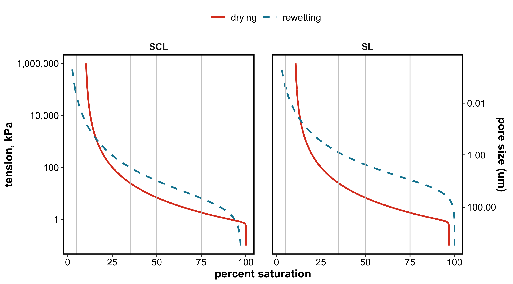
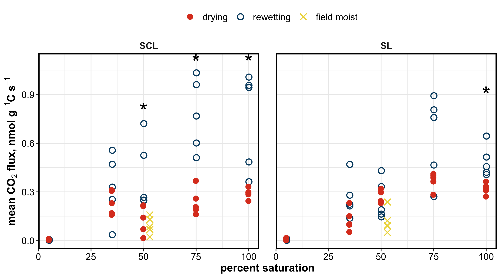
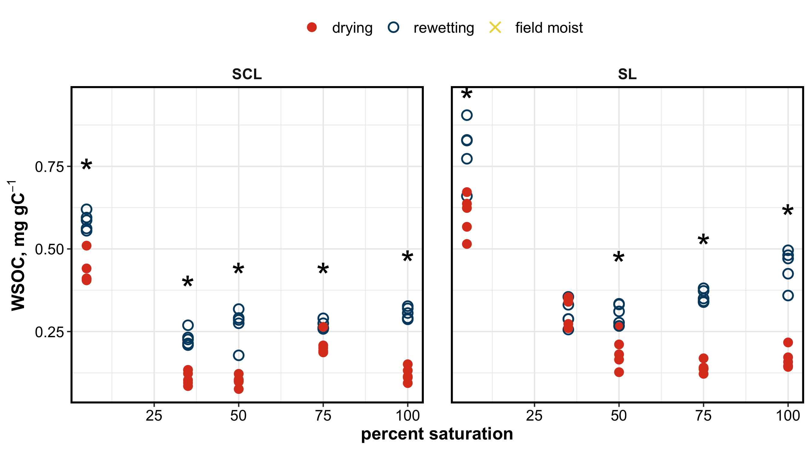
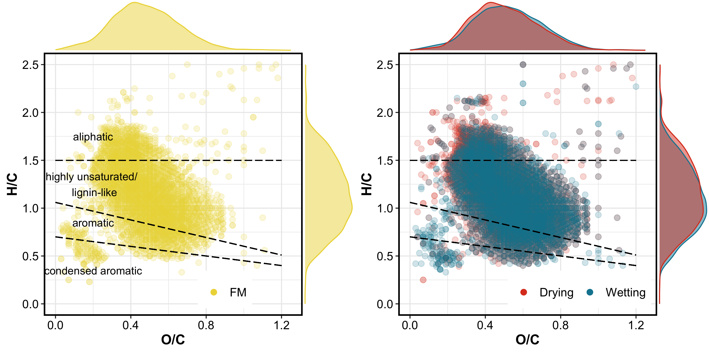
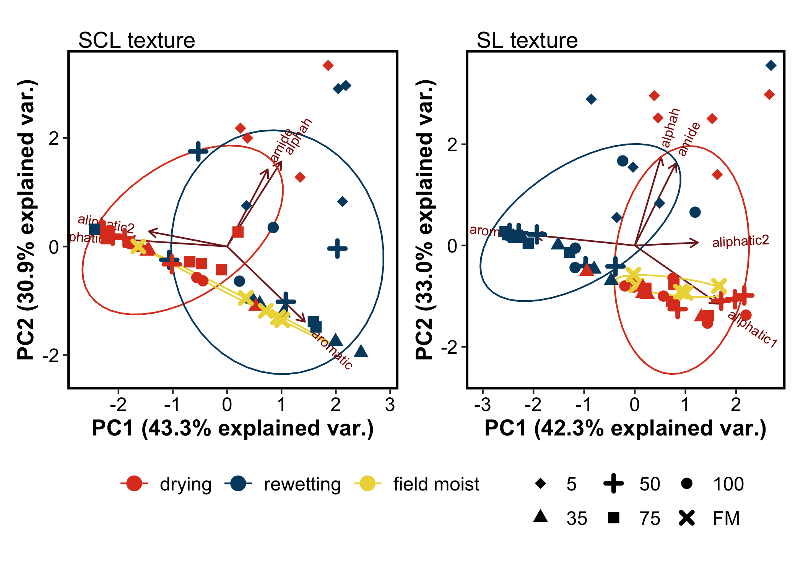
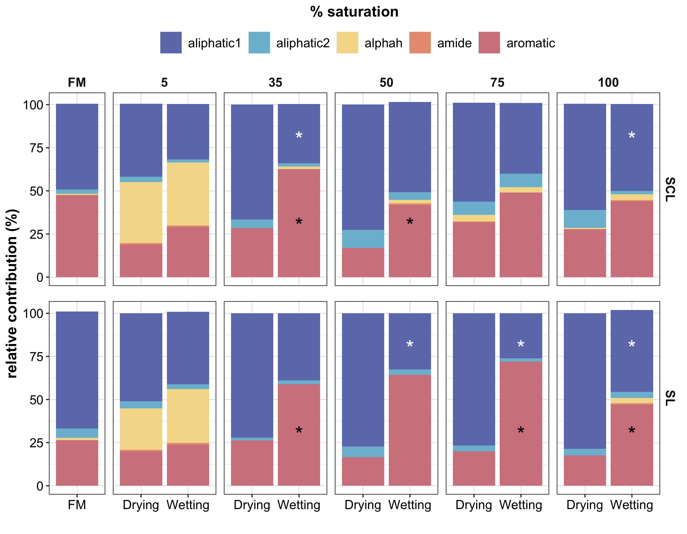

\[Hysteresis and Soil C\]
================

# Soil carbon dynamics during drying vs. rewetting: importance of antecedent moisture conditions

## results

-----

## WATER RETENTION CURVES

<!-- -->

-----

## RESPIRATION

    #>                              Df Sum Sq Mean Sq F value   Pr(>F)    
    #> treatment                     2 1.2411  0.6205  29.828 6.93e-11 ***
    #> texture                       1 0.0333  0.0333   1.599   0.2090    
    #> sat_level                     1 2.8265  2.8265 135.863  < 2e-16 ***
    #> treatment:texture             2 0.1739  0.0870   4.180   0.0181 *  
    #> treatment:sat_level           1 0.4240  0.4240  20.382 1.74e-05 ***
    #> texture:sat_level             1 0.0154  0.0154   0.742   0.3911    
    #> treatment:texture:sat_level   1 0.0909  0.0909   4.368   0.0392 *  
    #> Residuals                   100 2.0804  0.0208                     
    #> ---
    #> Signif. codes:  0 '***' 0.001 '**' 0.01 '*' 0.05 '.' 0.1 ' ' 1

<!-- -->

-----

## WSOC

    #>                             Df  Sum Sq Mean Sq F value   Pr(>F)    
    #> treatment                    1 0.10303 0.10303 188.679  < 2e-16 ***
    #> texture                      1 0.00189 0.00189   3.464 0.066807 .  
    #> sat_level                    1 0.00458 0.00458   8.392 0.004989 ** 
    #> treatment:texture            1 0.00201 0.00201   3.681 0.059006 .  
    #> treatment:sat_level          1 0.01380 0.01380  25.274 3.51e-06 ***
    #> texture:sat_level            1 0.00328 0.00328   6.014 0.016622 *  
    #> treatment:texture:sat_level  1 0.00665 0.00665  12.183 0.000828 ***
    #> Residuals                   72 0.03932 0.00055                     
    #> ---
    #> Signif. codes:  0 '***' 0.001 '**' 0.01 '*' 0.05 '.' 0.1 ' ' 1
    #> 10 observations deleted due to missingness

<!-- -->

-----

## FTICR

<!-- -->

-----

## NMR

### spectra

#### representative spectra – 50 % saturation

representative spectra – 5 % saturation

### PCA

<!-- -->

### RELATIVE ABUNDANCE

### tables

peaks in field moist soils

|      group |          SCL |           SL |
| ---------: | -----------: | -----------: |
| aliphatic1 | 49.71 ± 6.31 | 67.92 ± 2.97 |
| aliphatic2 |  2.55 ± 1.21 |   5.41 ± 1.1 |
|     alphah |    0.64 ± NA |    1.36 ± NA |
|   aromatic | 47.62 ± 7.38 | 26.39 ± 3.71 |

peaks in treatments

| texture |      group |   100-Drying |  100-Wetting |    35-Drying |   35-Wetting |     5-Drying |    5-Wetting |    50-Drying |    50-Wetting |    75-Drying |   75-Wetting |
| ------: | ---------: | -----------: | -----------: | -----------: | -----------: | -----------: | -----------: | -----------: | ------------: | -----------: | -----------: |
|     SCL | aliphatic1 | 61.67 ± 5.44 | 50.42 ± 3.36 | 66.53 ± 7.69 | 34.36 ± 6.34 | 42.28 ± 4.92 | 32.25 ± 6.61 | 72.66 ± 3.47 | 52.31 ± 10.09 | 57.27 ± 4.09 | 41.03 ± 9.98 |
|     SCL | aliphatic2 | 10.33 ± 1.03 |   1.9 ± 1.37 |  5.04 ± 1.51 |  1.82 ± 1.04 |  3.03 ± 0.81 |  1.74 ± 0.75 | 10.48 ± 1.96 |    4.41 ± 0.9 |  7.79 ± 5.93 |  7.83 ± 7.38 |
|     SCL |     alphah |    0.71 ± NA |  3.43 ± 0.57 |           NA |  1.56 ± 0.15 | 35.42 ± 4.85 | 36.51 ± 4.23 |           NA |      2.11 ± 1 |  3.73 ± 0.48 |  3.06 ± 0.52 |
|     SCL |      amide |           NA |    0.66 ± NA |           NA |           NA |    0.9 ± 0.2 |  0.86 ± 0.05 |           NA |   0.92 ± 0.13 |    0.41 ± NA |           NA |
|     SCL |   aromatic | 27.83 ± 6.58 | 43.91 ± 2.23 | 28.43 ± 8.03 | 62.61 ± 6.27 | 18.82 ± 4.89 | 29.07 ± 3.65 | 16.86 ± 3.38 | 41.81 ± 10.41 | 31.88 ± 2.02 | 49.1 ± 16.34 |
|      SL | aliphatic1 | 78.65 ± 7.29 | 47.52 ± 3.32 | 72.14 ± 6.35 | 38.95 ± 7.52 | 51.08 ± 6.11 | 41.98 ± 6.99 | 77.29 ± 3.73 |  32.55 ± 6.97 | 76.63 ± 6.03 | 26.08 ± 3.36 |
|      SL | aliphatic2 |  3.74 ± 1.38 |  3.44 ± 1.78 |  1.55 ± 0.31 |  2.12 ± 0.49 |  4.06 ± 0.82 |   2.86 ± 1.2 |  6.11 ± 1.81 |   3.11 ± 0.58 |  3.47 ± 0.96 |  1.93 ± 0.37 |
|      SL |     alphah |           NA |   3.1 ± 1.27 |           NA |           NA | 24.11 ± 1.98 | 31.23 ± 4.93 |           NA |            NA |           NA |           NA |
|      SL |      amide |           NA |   0.74 ± 0.2 |           NA |           NA |  0.81 ± 0.07 |    1.06 ± NA |           NA |            NA |           NA |           NA |
|      SL |   aromatic | 17.61 ± 7.05 | 47.12 ± 4.62 | 26.32 ± 6.45 | 58.93 ± 7.33 | 19.95 ± 5.62 | 23.72 ± 5.53 | 16.61 ± 4.22 |  64.33 ± 7.09 |   19.9 ± 5.5 |    72 ± 3.65 |

### more viz

<!-- -->

-----

### Session Info

Run: 2020-07-10

    #> R version 4.0.1 (2020-06-06)
    #> Platform: x86_64-apple-darwin17.0 (64-bit)
    #> Running under: macOS Mojave 10.14.6
    #> 
    #> Matrix products: default
    #> BLAS:   /Library/Frameworks/R.framework/Versions/4.0/Resources/lib/libRblas.dylib
    #> LAPACK: /Library/Frameworks/R.framework/Versions/4.0/Resources/lib/libRlapack.dylib
    #> 
    #> locale:
    #> [1] en_US.UTF-8/en_US.UTF-8/en_US.UTF-8/C/en_US.UTF-8/en_US.UTF-8
    #> 
    #> attached base packages:
    #> [1] stats     graphics  grDevices utils     datasets  methods   base     
    #> 
    #> other attached packages:
    #>  [1] patchwork_1.0.1    picarro.data_0.1.1 ggbiplot_0.55      drake_7.12.4      
    #>  [5] dplyr_1.0.0        DescTools_0.99.36  multcomp_1.4-13    TH.data_1.0-10    
    #>  [9] MASS_7.3-51.6      survival_3.2-3     mvtnorm_1.1-1      gsheet_0.4.5      
    #> [13] googlesheets_0.3.0 agricolae_1.3-3    car_3.0-8          carData_3.0-4     
    #> [17] nlme_3.1-148       stringi_1.4.6      ggExtra_0.9        ggalt_0.4.0       
    #> [21] reshape2_1.4.4     knitr_1.28         qwraps2_0.4.2      cowplot_1.0.0     
    #> [25] data.table_1.12.8  Rmisc_1.5          plyr_1.8.6         lattice_0.20-41   
    #> [29] tidyr_1.1.0        luzlogr_0.2.0      stringr_1.4.0      lubridate_1.7.9   
    #> [33] readr_1.3.1        ggplot2_3.3.2      readxl_1.3.1      
    #> 
    #> loaded via a namespace (and not attached):
    #>  [1] colorspace_1.4-1   ellipsis_0.3.1     rio_0.5.16         rstudioapi_0.11   
    #>  [5] farver_2.0.3       soilpalettes_0.1.0 fansi_0.4.1        codetools_0.2-16  
    #>  [9] splines_4.0.1      extrafont_0.17     Rttf2pt1_1.3.8     cluster_2.1.0     
    #> [13] shiny_1.5.0        compiler_4.0.1     backports_1.1.8    assertthat_0.2.1  
    #> [17] Matrix_1.2-18      fastmap_1.0.1      cli_2.0.2          later_1.1.0.1     
    #> [21] prettyunits_1.1.1  htmltools_0.5.0    tools_4.0.1        igraph_1.2.5      
    #> [25] gtable_0.3.0       glue_1.4.1         maps_3.3.0         Rcpp_1.0.4.6      
    #> [29] cellranger_1.1.0   vctrs_0.3.1        extrafontdb_1.0    xfun_0.15         
    #> [33] openxlsx_4.1.5     mime_0.9           miniUI_0.1.1.1     lifecycle_0.2.0   
    #> [37] zoo_1.8-8          scales_1.1.1       hms_0.5.3          promises_1.1.1    
    #> [41] parallel_4.0.1     proj4_1.0-10       sandwich_2.5-1     expm_0.999-4      
    #> [45] RColorBrewer_1.1-2 yaml_2.2.1         curl_4.3           labelled_2.5.0    
    #> [49] highr_0.8          klaR_0.6-15        AlgDesign_1.2.0    PNWColors_0.1.0   
    #> [53] filelock_1.0.2     boot_1.3-25        zip_2.0.4          storr_1.2.1       
    #> [57] rlang_0.4.6        pkgconfig_2.0.3    evaluate_0.14      purrr_0.3.4       
    #> [61] labeling_0.3       tidyselect_1.1.0   magrittr_1.5       R6_2.4.1          
    #> [65] generics_0.0.2     base64url_1.4      combinat_0.0-8     txtq_0.2.3        
    #> [69] pillar_1.4.4       haven_2.3.1        foreign_0.8-80     withr_2.2.0       
    #> [73] abind_1.4-5        ash_1.0-15         tibble_3.0.1       crayon_1.3.4      
    #> [77] questionr_0.7.1    KernSmooth_2.23-17 rmarkdown_2.3      progress_1.2.2    
    #> [81] grid_4.0.1         forcats_0.5.0      digest_0.6.25      xtable_1.8-4      
    #> [85] httpuv_1.5.4       munsell_0.5.0
